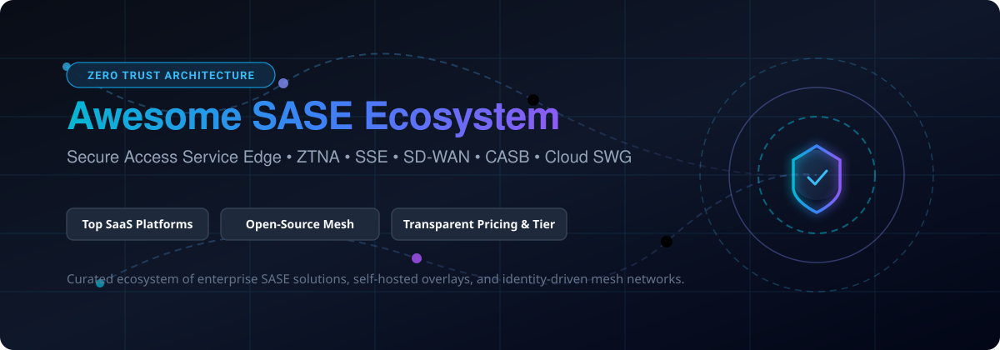

<div align="center">

<a href="assets/banner.svg">
  
</a>

# 🛡️ Awesome Secure Access Service Edge (SASE) 🌐

**A curated index of premier SASE platforms, Security Service Edge (SSE), Zero Trust Network Access (ZTNA), cloud-native firewalls (FWaaS), and self-hosted open-source mesh networks.**

<p align="center">
  <a href="https://github.com/ishandutta2007/Awesome-Awesome-Awesome"></a>
  <a href="https://discord.gg/jc4xtF58Ve"></a>
  <a href="https://github.com/ishandutta2007/Awesome-Secure-Access-Service-Edge/stargazers"></a>
  <a href="https://github.com/ishandutta2007/Awesome-Secure-Access-Service-Edge/network/members"></a>
  <a href="https://github.com/ishandutta2007/Awesome-Secure-Access-Service-Edge/issues"></a>
  <a href="https://github.com/ishandutta2007/Awesome-Secure-Access-Service-Edge/blob/main/LICENSE"></a>
  <a href="https://github.com/ishandutta2007"></a>
</p>

<p align="center">
  <b>Discover enterprise cloud security & open-source Zero Trust networking alternatives to replace legacy VPNs.</b><br>
  <sub>📅 Last updated: September 2026 • Curated with ❤️ for security architects, DevSecOps & network engineers</sub>
</p>

</div>

---

## 📑 Table of Contents
- [📌 Overview & Architecture](#-overview--architecture)
- [📊 SASE Market Dynamics & Sizing](#-sase-market-dynamics--sizing)
- [☁️ SaaS / Hosted SASE Platforms](#️-saashosted-sase-platforms)
- [🔓 Open-Source GitHub Projects](#-open-source-github-projects)
- [🧩 Architectural Comparison: Enterprise SASE vs. Self-Hosted ZTNA](#-architectural-comparison-enterprise-sase-vs-self-hosted-ztna)
- [📈 Star History](#-star-history)
- [🤝 How to Contribute](#-how-to-contribute)
- [⚠️ Disclaimer](#️-disclaimer)

---

## 📌 Overview & Architecture

**Secure Access Service Edge (SASE)** brings together Software-Defined Wide Area Networking (**SD-WAN**) and comprehensive cloud-delivered security (**Security Service Edge / SSE**) into a unified, identity-aware fabric. By decoupling security perimeter inspection from physical data centers, SASE ensures low-latency, least-privilege access across distributed branch sites, cloud applications, and remote workforces.

### Key Functional Pillars:
- 🔐 **Zero Trust Network Access (ZTNA)**: Identity-verified, contextual application routing without exposing network perimeters or open ports.
- 🛡️ **Cloud Secure Web Gateway (SWG)**: Threat prevention, TLS inspection, URL filtering, and malware scanning at edge PoPs.
- ☁️ **Cloud Access Security Broker (CASB)**: Deep visibility into SaaS usage, shadow IT governance, and granular API compliance monitoring.
- 🔥 **Firewall-as-a-Service (FWaaS)**: Scalable L3–L7 cloud firewalling with integrated intrusion prevention systems (IPS/IDS).
- 🧭 **Software-Defined WAN (SD-WAN)**: Dynamic multi-path routing, SaaS optimization, and automated branch connectivity.
- 🔍 **Data Loss Prevention (DLP)**: Unified content inspection preventing unauthorized exfiltration of sensitive organizational assets.

---

## 📊 SASE Market Dynamics & Sizing

> 💡 **Market Size & Structure**: The global Secure Access Service Edge (SASE) market is estimated at **$15.5B – $19.2B in 2026** (scaling from ~$12.2B in 2025 at a CAGR of 22%–27%), and is **moderately concentrated** at the top tier—with the top five enterprise security providers (Palo Alto Networks, Cisco, Fortinet, Cloudflare, and Zscaler) capturing ~42% of global deployments—while remaining highly dynamic and competitive across mid-market and niche software-defined networking disruptors.

---

## ☁️ SaaS / Hosted SASE Platforms

Below is an overview of the industry-leading commercial SASE and SSE platforms, sorted in descending order by **Company Scale (Market Capitalization / Valuation / Annual Revenue)**.

| Platform | Company Scale (Valuation / Revenue) | Description | Pricing (Starting Tiers) | Free Tier / Trial Limits |
| :--- | :--- | :--- | :--- | :--- |
| **[Cisco Secure Access](https://www.cisco.com/)** | **~$430B – $435B Market Cap** (Public: CSCO) | Enterprise SASE & SSE portfolio (converging Duo identity, Umbrella cloud security, and SD-WAN) built for large-scale enterprise deployments. | DNS-layer starting tier ~**$1.50 – $2.50/user/month**; full Secure Access SSE / SIG Essentials starts at ~**$4 – $8/user/month** (typically 50 user min.) | **14-day free trial**: Standard self-service/partner trial supporting full Secure Access inspection, posture enforcement, and policy testing; extendable upon partner request. |
| **[Palo Alto Prisma SASE](https://www.paloaltonetworks.com/sase)** | **~$220B – $270B Market Cap** (Public: PANW) | Converged Prisma Access & Prisma SD-WAN offering NGFW-grade cloud inspection, threat defense, and AI-driven ZTNA 2.0. | Enterprise starting tiers range from ~**$8 – $25/user/month** (typically requires an enterprise minimum commitment of 200 users) | **30-day PoC trial**: Partner and sales-assisted Proof of Concept (typically capped at 30 users or designated branch locations); modular add-on trials via Strata Cloud Manager. |
| **[Fortinet FortiSASE](https://www.fortinet.com/)** | **~$115B Market Cap** (Public: FTNT) | Cloud-delivered SASE natively coupled with the Fortinet Security Fabric, unified FortiOS management, and secure SD-WAN appliances. | Standard tier starts at ~**$90/user/year** (~$7.50/user/month) for the 50–499 user band (minimum 50 user license) | **30-day free trial**: Sales engineer-assisted trial license valid for 30 days for evaluation and non-production testing with designated test accounts. |
| **[Cloudflare One](https://www.cloudflare.com/cloudflare-one/)** | **~$100B Market Cap** (Public: NET) | High-performance Zero Trust SASE platform built on Cloudflare’s 330+ city global Anycast edge — includes Access (ZTNA), Gateway (SWG), WARP client, and CASB. | Paid plan starts at **$7/user/month** (Pay-as-you-go, billed annually) for teams scaling beyond free boundaries | **Free forever plan**: Up to 50 users, 24-hour activity log retention, DNS security filtering across up to 3 physical locations, and 2 read-only CASB API integrations. |
| **[Zscaler](https://www.zscaler.com/)** | **~$26B Market Cap** • $3.35B Revenue (Public: ZS) | Pioneer enterprise cloud-native Zero Trust Exchange delivering large-scale SSE (ZIA internet security, ZPA private application access, and ZDX digital experience monitoring). | ZIA starting tier ~**$72/user/year** (~$6/user/month); ZPA starting tier ~**$140/user/year** (~$11.67/user/month); ZDX add-on ~**$24 – $60/user/year** (annual contract required) | **30-day free trial**: Available upon request for targeted modules (such as Advanced Cloud Sandbox or ZIA/ZPA evaluation module with PoC limits); customized live interactive demos. |
| **[Check Point Harmony SASE](https://www.checkpoint.com/)** | **~$14B Market Cap** (Public: CHKP) | Hybrid SASE & SSE solution (integrating Perimeter 81 heritage) providing 2x faster private connection speeds and unified prevention-first cloud security. | Entry-level plan starts at **$10/user/month** (billed annually) for core ZTNA & private gateway features | **30-day free trial**: Accessible via Check Point Infinity Portal; supports up to 200 users and connects branch offices to cloud service locations for 30 days. |
| **[Netskope](https://www.netskope.com/)** | **~$5.8B Market Cap** • $709M Revenue (Public: NTSK) | Cloud-native Security Service Edge (SSE) powerhouse with market-leading CASB, granular data loss prevention (DLP), and NewEdge global private cloud infrastructure. | Base SSE bundle (SWG + CASB) starts at ~**$4 – $8/user/month**; mid-tier with ZTNA & DLP starts at ~**$9 – $14/user/month** (annual contract) | **Proof of Concept (PoC) / Test Drive**: Hands-on interactive virtual labs and guided enterprise PoC trial (typically **14 to 30 days** scoped for dedicated pilot user groups). |
| **[Cato Networks](https://www.catonetworks.com/)** | **~$4.8B Valuation** • $415M+ ARR (Private) | Pioneer single-vendor SASE platform featuring a purpose-built global private backbone, integrated cloud SD-WAN, and seamless edge security convergence. | Small branch/site bandwidth license starts at ~**$100/site/month** (for 25 Mbps); remote ZTNA client user licenses scale additionally | **30-day free trial / PoC**: Official trial license valid for 30 days with full platform access across designated PoC test sites and client devices; interactive read-only console demo mode. |
| **[Versa SASE](https://versa-networks.com/)** | **~$700M+ Valuation** (Private) | Unified multi-tenant SASE platform tightly combining carrier-grade SD-WAN, Next-Gen Firewall, and cloud security orchestration for service providers and enterprises. | Starting enterprise subscription tier starts at ~**$7.50/user/month** for foundational SASE/SWG capabilities | **90-day free trial**: Enterprise SASE / SWG trial supporting up to 100 users for eligible enterprise evaluations; cloud sandbox and AWS test instances available. |
| **[Open Systems](https://www.open-systems.com/)** | **$100M+ Revenue** (Acquired by Swiss Post) | Managed SASE and secure edge networking platform oriented toward enterprise operational simplicity, 24/7 Mission Control L3 engineering, and global connectivity. | Base self-serve platform starts from **CHF 1.99/user/month** (5k–10k user band); Network Connect module starts from **CHF 3.98/user/month** | **30-day managed PoC trial**: Scoped proof-of-concept trial (typically 30 days, extensible up to 1–3 months depending on network scope) with designated Level-3 engineer support; interactive live demo. |

---

## 🔓 Open-Source GitHub Projects

Open-source technologies form the critical foundation of modern Zero Trust and SASE deployments—powering point-to-point WireGuard meshes, self-hosted control planes, identity-aware proxies, and hardened edge firewalls. 

The projects below are sorted in descending order by **GitHub Star Counts** (with live social badges linking to their respective stargazers):

| Repository / Project | Stars_Badge | Architecture / Primary Role | Description |
| :--- | :---: | :--- | :--- |
| **[Headscale](https://github.com/juanfont/headscale)** | [](https://github.com/juanfont/headscale/stargazers) | Self-Hosted Coordination Server (ZTNA Control Plane) | Open-source, self-hosted implementation of the Tailscale coordination server. Enables sovereign, private mesh networks using official Tailscale client applications. |
| **[Tailscale Client Core](https://github.com/tailscale/tailscale)** | [](https://github.com/tailscale/tailscale/stargazers) | Mesh VPN Client & Coordination Protocol | Cross-platform WireGuard-based mesh client and networking utilities connecting computers, servers, and cloud instances across NATs and firewalls. |
| **[NetBird](https://github.com/netbirdio/netbird)** | [](https://github.com/netbirdio/netbird/stargazers) | Complete Self-Hosted ZTNA Platform | Turnkey WireGuard-based Zero Trust overlay network with web management UI, automated key rotation, MFA/SSO identity federation, posture checks, and routing relays. |
| **[Teleport](https://github.com/gravitational/teleport)** | [](https://github.com/gravitational/teleport/stargazers) | Identity-Native Infrastructure Access | Zero Trust access gateway providing identity-based routing and auditability for SSH servers, Kubernetes clusters, web applications, databases, and Windows desktops. |
| **[Nebula](https://github.com/slackhq/nebula)** | [](https://github.com/slackhq/nebula/stargazers) | Mutually Authenticated Overlay Mesh | Scalable, portable overlay networking tool created by Slack. Employs certificate-based authentication, discovery beacons, and per-host firewalling across multi-cloud topologies. |
| **[ZeroTier](https://github.com/zerotier/ZeroTierOne)** | [](https://github.com/zerotier/ZeroTierOne/stargazers) | Decentralized Virtual Ethernet Switch | Connects cloud servers, edge IoT devices, and workstations into a single cryptographically secure Layer-2 virtual network that spans any internet connection. |
| **[Cloudflared](https://github.com/cloudflare/cloudflared)** | [](https://github.com/cloudflare/cloudflared/stargazers) | Identity-Aware App Tunnel / Connector | Open-source client for Cloudflare Zero Trust Tunnels. Securely connects internal HTTP, TCP, SSH, and RDP services to the edge without opening public inbound ports. |
| **[Firezone](https://github.com/firezone/firezone)** | [](https://github.com/firezone/firezone/stargazers) | Open-Source WireGuard ZTNA | Fast, modern remote access platform and WireGuard-based alternative to traditional corporate VPNs with IdP integration and fine-grained resource rules. |
| **[pfSense](https://github.com/pfsense/pfsense)** | [](https://github.com/pfsense/pfsense/stargazers) | Open-Source Firewall & Edge Router | Proven FreeBSD-based firewall, router, and VPN gateway frequently utilized as a secure branch edge appliance and SD-WAN termination endpoint. |
| **[Pomerium](https://github.com/pomerium/pomerium)** | [](https://github.com/pomerium/pomerium/stargazers) | Context-Driven Identity-Aware Reverse Proxy | BeyondCorp-inspired identity-aware proxy providing context-sensitive authentication, authorization, and secure private application access without VPN clients. |
| **[OPNsense](https://github.com/opnsense/core)** | [](https://github.com/opnsense/core/stargazers) | Hardened Security Edge Appliance | High-performance open-source routing and firewall platform offering enterprise IPS/IDS, multi-WAN failover, Netflow reporting, and WireGuard integration. |
| **[OpenZiti](https://github.com/openziti/ziti)** | [](https://github.com/openziti/ziti/stargazers) | Application-Embedded Programmable Zero Trust | Groundbreaking programmable zero-trust overlay fabric allowing developers to embed zero-trust dark routing directly into application code via native SDKs. |
| **[Squid Proxy](https://github.com/squid-cache/squid)** | [](https://github.com/squid-cache/squid/stargazers) | Caching Web Proxy & SWG Building Block | High-performance web caching and forward proxy supporting SSL bumping, access control lists (ACLs), and outbound traffic governance for open SWG architectures. |
| **[strongSwan](https://github.com/strongswan/strongswan)** | [](https://github.com/strongswan/strongswan/stargazers) | Multi-Platform IPsec SASE Building Block | Industry-standard open-source IPsec-based VPN implementation supporting IKEv2, EAP authentication, and site-to-cloud encrypted backhaul tunnels. |
| **[WireGuard Linux Compat](https://github.com/WireGuard/wireguard-linux-compat)** | [](https://github.com/WireGuard/wireguard-linux-compat/stargazers) | High-Speed Kernel Encryption Engine | The revolutionary, high-speed, cryptographically audited tunnel protocol that powers nearly all next-generation open-source and commercial ZTNA networks. |

---

## 🧩 Architectural Comparison: Enterprise SASE vs. Self-Hosted ZTNA

Organizations frequently balance proprietary enterprise SASE platforms with self-hosted open-source stacks:

```
+---------------------------------------------------------------------------------------+
|                                 SASE Functional Layers                                |
+------------------------------------+--------------------------------------------------+
| Commercial SASE / SSE Fabric       | Open-Source / Self-Hosted Building Blocks         |
+------------------------------------+--------------------------------------------------+
| Global Anycast Edge (PoPs)         | Cloud VPS / Bare Metal Edge Nodes / Anycast BGP   |
| Zero Trust Network Access (ZTNA)   | NetBird, Headscale, OpenZiti, Firezone           |
| Software-Defined WAN (SD-WAN)      | OPNsense, pfSense, WireGuard, FRRouting          |
| Secure Web Gateway (SWG)           | Squid, e2guardian, AdGuard Home, Pi-hole         |
| Identity-Aware Reverse Proxy (IAP) | Pomerium, Cloudflared, Caddy, Authentik          |
| Identity Federation (IdP / IAM)    | Keycloak, Authentik, Authelia                    |
| CASB & Advanced Enterprise DLP     | Proprietary multi-tenant cloud inspection engines|
+------------------------------------+--------------------------------------------------+
```

### 💡 Best Practice Architecture:
1. **Private Resource Access**: Combine **NetBird** or **Headscale + Tailscale clients** for friction-free, peer-to-peer device mesh and internal server access.
2. **Web & App Portless Ingress**: Deploy **OpenZiti** or **Pomerium** to eliminate public open firewall ports through zero-trust dark application embedding.
3. **Branch Office Edge**: Implement **OPNsense** or **pfSense** at office branches for firewalling, multi-WAN load balancing, and WireGuard tunnels.
4. **Internet Inspection & Compliance**: When comprehensive cloud-delivered DLP, inline CASB, and global low-latency proxy inspection are regulatory necessities, integrate with commercial platforms such as **Cloudflare One**, **Zscaler**, or **Palo Alto Prisma SASE**.

---

## 📈 Star History

[](https://star-history.dera.page/#ishandutta2007/Awesome-Secure-Access-Service-Edge&type=date&legend=top-left)

---

## 🤝 How to Contribute

Contributions are warmly encouraged! To add or enhance an entry:
1. 🍴 **Fork the repository**.
2. 📝 **Add or edit entries in `README.md`** following the existing tabular structure.
3. 🔎 **Provide factual data**: Include verified pricing starting tiers, explicit free tier / trial terms, or GitHub star counters.
4. 🚀 **Submit a Pull Request** with a concise description of your additions.

⭐ **If this directory helps your security or infrastructure planning, please star the repo to support the project!**

---

## ⚠️ Disclaimer

- This repository is a **community-curated index** created for architectural reference and educational exploration; it does not constitute formal commercial endorsement or security advisory.
- Secure Access Service Edge (SASE) and Zero Trust architectures govern network transit for critical business services and sensitive data. Misconfiguration can result in service disruptions, authentication bypasses, or data exposure.
- Always rigorously test posture validation policies, multi-WAN failover procedures, and cryptographic access controls in staging environments prior to production rollout.

---

<div align="center">
  <b>Built with 🔐 for security architects, network engineers, and platform teams designing resilient, least-privilege infrastructure.</b><br>
  <sub>Let's keep network traffic encrypted, identity-verified, and as open as your threat model allows.</sub>
</div>
